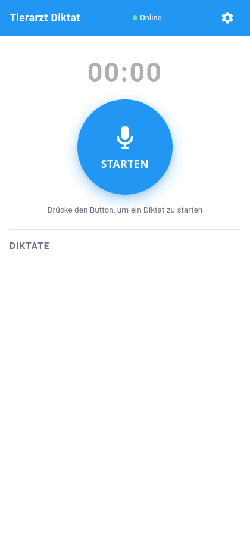
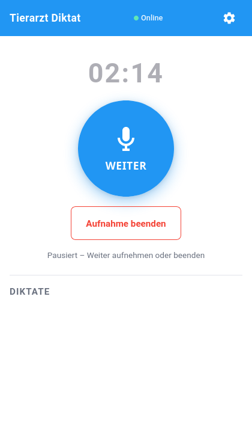
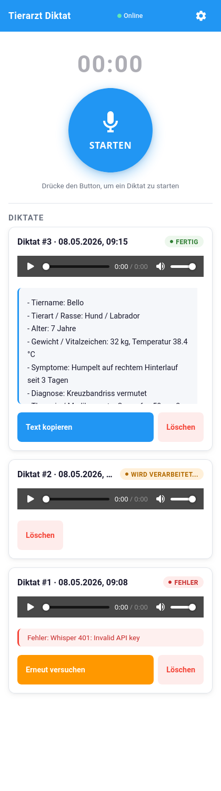
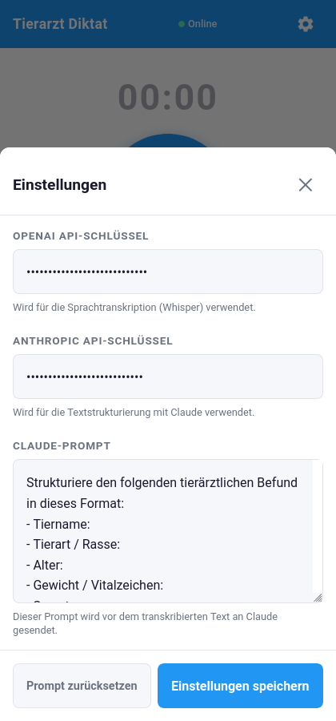

# Tierarzt Diktat

Eine Progressive Web App (PWA) zum Diktieren und automatischen Strukturieren von tierärztlichen Befunden. Aufnahme im Browser, Transkription per OpenAI Whisper, Strukturierung per Claude — vollständig offline-fähig mit Warteschlange.

## Screenshots

| Hauptscreen | Pausierte Aufnahme | Diktatliste | Einstellungen |
|---|---|---|---|
|  |  |  |  |

## Features

- **Großer One-Hand-Aufnahme-Button** mit Zustandsmaschine: `Starten → Pause → Weiter → Beenden`
- **Bis zu 15 min Aufnahme** je Diktat, mehrere Diktate in Warteschlange
- **Audio bleibt lokal** (IndexedDB) — kein Upload bis Verarbeitung
- **Offline-First**: Fehlt das Netz, wartet das Diktat. Kommt das Netz zurück, läuft die Verarbeitung automatisch an
- **Whisper** (OpenAI) für die Transkription, **Claude Haiku 4.5** für die Strukturierung
- **Anpassbarer Prompt** in den Einstellungen
- **Audio-Wiedergabe** der Original-Aufnahme direkt in der Diktat-Karte
- **Retry mit exponentiellem Backoff** (2 s, 4 s, 8 s) — bis zu 3 Versuche, danach manueller Retry
- **PWA**: Installierbar auf dem Homescreen, Service Worker für Offline-Betrieb

## Datenfluss

```
Mikrofon → MediaRecorder (audio/webm)
        → IndexedDB (status: waiting)
        → processQueue()
            → Whisper API   (https://api.openai.com)
            → Claude API    (https://api.anthropic.com)
        → IndexedDB (status: done, strukturierterText)
        → UI-Render
```

## Schnellstart

```bash
# Lokal starten
python3 -m http.server 8765
```

Dann im Browser auf `http://localhost:8765` öffnen.

Beim ersten Start:
1. Auf das Zahnrad oben rechts tippen
2. **OpenAI API-Schlüssel** und **Anthropic API-Schlüssel** eintragen
3. Speichern — die Keys werden ausschließlich im `localStorage` des Geräts abgelegt
4. Mikrofon-Zugriff im Browser erlauben
5. Aufnahme starten

> **Hinweis**: Mikrofon-Zugriff funktioniert nur über `https://` oder `http://localhost`. Für ein Deployment auf z.B. GitHub Pages genügt das.

## API-Keys

| Dienst | Wofür | Bezug |
|---|---|---|
| OpenAI | Whisper-Transkription | <https://platform.openai.com/api-keys> |
| Anthropic | Claude-Strukturierung | <https://console.anthropic.com/settings/keys> |

Die Keys werden ausschließlich lokal im Browser gespeichert (`localStorage`). Der Anthropic-Aufruf nutzt den Header `anthropic-dangerous-direct-browser-access: true` für direkte Browser-Anfragen — dies ist eine Single-User-App; für Multi-User-Deployments wäre ein Proxy nötig.

## Architektur

Vanilla HTML / CSS / JavaScript — kein Framework, kein Build-Schritt.

| Datei | Inhalt |
|---|---|
| `index.html` | Markup + komplettes inline CSS (Mobile-first, Touch-Targets ≥ 56 px) |
| `app.js` | Gesamte Logik in einem `DOMContentLoaded`-Handler |
| `service-worker.js` | Cache-First für lokale Dateien, Network-Only für API-Calls |
| `manifest.json` | PWA-Manifest mit inline SVG-Icons (Data-URLs) |

Funktionsgruppen in `app.js` (in Reihenfolge): IndexedDB → Timer → Recorder-FSM → Aufnahme → Queue/Verarbeitung → Whisper-API → Claude-API → Rendering → Online/Offline → Einstellungen → Init.

## Konfiguration

In `app.js`:

| Parameter | Wert | Bedeutung |
|---|---|---|
| `MAX_AUFNAHME_SEKUNDEN` | `15 * 60` | Auto-Stop nach 15 min |
| `MAX_RETRY` | `3` | Retry-Versuche pro Diktat |
| `RETRY_BASIS_MS` | `2000` | Backoff-Basis (2 s, 4 s, 8 s) |
| Whisper-Modell | `whisper-1`, `language: "de"` | |
| Claude-Modell | `claude-haiku-4-5-20251001`, `max_tokens: 1024` | |

## Deployment auf GitHub Pages

Alle Pfade sind relativ — Repository einfach auf GitHub Pages aktivieren:

1. **Settings → Pages → Source: Deploy from branch → main / root**
2. Nach 1–2 min unter `https://<user>.github.io/Tierarzt-App/` erreichbar

## Cache-Versionierung

Bei Breaking Changes an `index.html` oder `app.js` muss `CACHE_NAME` in `service-worker.js` hochgezählt werden, damit der Browser den alten Cache verwirft. Aktuell: `tierarzt-diktat-v3`.

Zum erzwungenen Refresh im Browser: **Strg+Shift+R**. Bei hartnäckigen Cache-Problemen DevTools → Application → Service Workers → Unregister.

## Sicherheitshinweise

- API-Keys liegen nur im Browser-`localStorage` — niemals im Code committen
- Keine personenbezogenen Daten gehen über die App selbst hinaus, **aber** Audio + Transkript werden an OpenAI bzw. Anthropic gesendet. Vor produktivem Einsatz Datenschutz-Konformität (DSGVO, Praxis-Richtlinien) prüfen.
- Direkter Browser-Zugriff zu Anthropic ist bewusst aktiviert (`anthropic-dangerous-direct-browser-access`) — bei kompromittiertem Browser-Plugin abgreifbar

## Browser-Kompatibilität

Erforderlich:
- `MediaRecorder` (alle modernen Browser)
- `IndexedDB`
- `Service Worker` (Offline-Funktion)
- `getUserMedia` (Mikrofon)

Getestet mit aktuellem Firefox und Chromium auf Linux/Android.

## Lizenz

MIT
